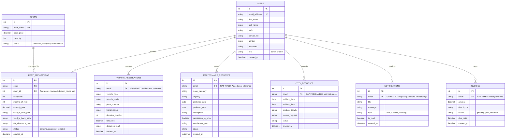

# Apartment Management System - Database Schema

This document outlines all possible and recommended database tables for both User and Admin operations. It also explicitly addresses existing architecture gaps found in the current endpoints.

## 1. Identified Gaps & Solutions

| Existing Gap | Proposed Solution |
|--------------|-------------------|
| **Missing User Association** | Endpoints for `parking_reservations`, `maintenance_requests`, and `cctv_requests` are missing a reference to the user who made them. We added an `email` (or `user_id`) foreign key to these tables. |
| **Notifications Not Persisted** | Currently handled via `localStorage` on the frontend. A new `notifications` table is added to support persistent real-time syncing across devices for both users and admins. |
| **Hardcoded Rooms** | Rooms are currently stored merely as string names (`room_name`). A new `rooms` table is introduced to track availability, capacity, and current price. |
| **No Payment/Invoice Tracking** | No table exists to track monthly rent payments or reservation fees. An `invoices` table is added. |

---

## 2. Entity Relationship Diagram (ERD)

## 3. Table Definitions

### 3.1. Core Entities
- **users**: Stores authentication and profile data for both tenants and admins. Distinguished by the `role` column.
- **rooms**: Tracks apartment units, their pricing, capacities, and availability.

### 3.2. User Requests & Applications
- **rent_applications**: Links a user to a specific room request, tracking lease duration and required documents.
- **parking_reservations**: Tracks parking slot requests, vehicle details, and registration documents. *(Gap fixed: Now linked to `users.email`)*.
- **maintenance_requests**: Tracks repair and maintenance reports made by tenants. *(Gap fixed: Now linked to `users.email`)*.
- **cctv_requests**: Logs formal requests to view CCTV footage. *(Gap fixed: Now linked to `users.email`)*.

### 3.3. System Features
- **notifications**: Stores in-app alerts (e.g., Application Approved, Maintenance Scheduled) so they persist on the backend instead of just frontend storage.
- **invoices**: Handles billing for rent applications, parking reservations, and monthly dues.

---

## 4. Data Flow & Metric Computation Analysis

This section maps how user-submitted data is processed and aggregated to generate the metrics displayed on the Admin Dashboard. Currently, many of these metrics are computed or hardcoded on the frontend, but architecturally they should be derived from the database as follows:

| Admin Dashboard Metric | Computed From (User Inputs & Tables) | Computation Logic (Backend / DB Level) |
|------------------------|--------------------------------------|----------------------------------------|
| **Total Revenue** | `invoices` (Rent & Parking payments) | `SUM(amount)` from `invoices` where `status = 'paid'` for the current month. |
| **Income Overview Chart** | `invoices` | Grouped sum of `invoices.amount` by month, potentially subtracting tracked expenses. |
| **Pending Dues** | `invoices` | `SUM(amount)` from `invoices` where `status = 'pending'` or `'overdue'`. |
| **Total Tenants** | `rent_applications` | `COUNT(DISTINCT email)` from `rent_applications` where `status = 'approved'`. |
| **Occupancy Rate** | `rooms` and `rent_applications` | `(COUNT(rooms) WHERE status='occupied' / COUNT(rooms))` * 100. *Currently computed purely on the frontend.* |
| **Vacant Units** | `rooms` | `COUNT(id)` from `rooms` where `status = 'available'`. |
| **Maintenance Backlog** | `maintenance_requests` | `COUNT(id)` from `maintenance_requests` where `status = 'pending'`. |
| **Rent Collection Rate** | `invoices` and `rent_applications`| `(Tenants who paid current month invoice / Total active tenants)` * 100. |
| **System Activity Log** | Various Tables | A union or trigger-based log aggregating recent inserts from `invoices`, `maintenance_requests`, and `rent_applications`. |

### Architectural Note: Frontend vs. Backend Computation
Currently, the `AdminDashboard.jsx` computes percentages (like the 85% occupancy rate) directly within the frontend logic using hardcoded numbers (`24 / 28 Units`). 

**Best Practice Implementation**:
The frontend should merely receive these final aggregated values or the raw numerator/denominator from a backend endpoint (e.g., `/api/admin/dashboard_stats.php`). 
Performing `COUNT()` and `SUM()` aggregations on the database side ensures data integrity, significantly reduces payload size, and keeps the frontend decoupled from raw business data.
