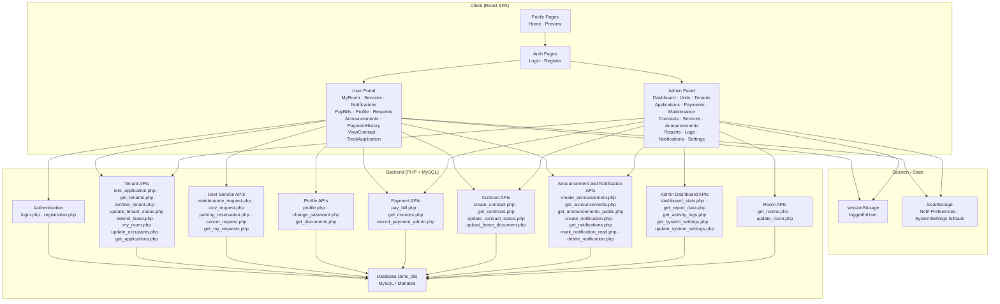
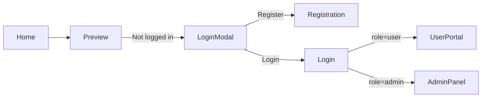
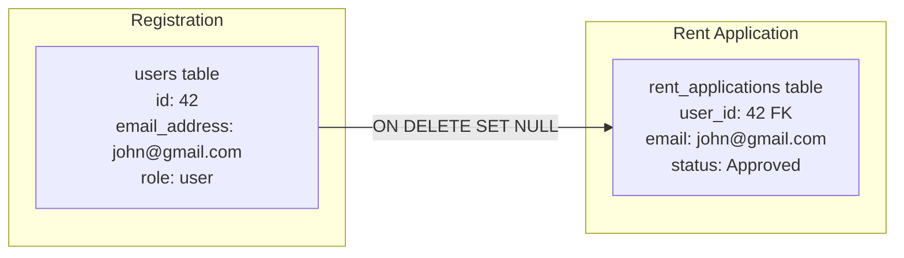

# Apartment Management System — Full System Design

> **Document Version:** 2.0 — July 2026
> **Stack:** React (Vite) + PHP + MySQL (XAMPP / MariaDB)

---

## 1. Overview

This document provides a complete architectural and design reference for the Apartment Management System (AMS). It covers the full data model, all user and admin workflows, currently implemented features, and identified gaps.

AMS has two main actor roles:

| Actor | Access | Entry Point |
|-------|--------|-------------|
| **Guest / Prospective Tenant** | Public pages, registration | `/home`, `/preview`, `/register` |
| **Tenant (User)** | Protected user portal | `/services`, `/my-room`, `/pay-bills`, etc. |
| **Administrator** | Admin panel | `/admin-dashboard`, `/admin-*` |

---

## 2. Database — Entity Relationship Diagram

> [!NOTE]
> All 12 planned tables now exist in `ams_db`. The `user_id` FK has been added to `rent_applications`, and the `status` column has been added to `parking_reservations`. Remaining structural issues are documented inline.

```mermaid
erDiagram
    USERS {
        int id PK
        varchar first_name
        varchar last_name
        varchar middle_name
        varchar suffix
        varchar contact_no
        varchar gender
        varchar email_address UK
        varchar password
        varchar role "user or admin"
        timestamp created_at
    }

    ROOMS {
        varchar id PK "e.g. letter-coded: 'A', 'B'"
        varchar type "Studio, 1BR"
        varchar floor
        decimal monthly_rent
        varchar status "Vacant, Occupied, Maintenance"
        varchar tenant_name "string, not FK to users"
        int occupants
        date lease_start
        date lease_end
        varchar last_tenant
        tinyint maintenance_flag
        timestamp created_at
    }

    RENT_APPLICATIONS {
        int id PK
        int user_id FK "Added - nullable, references users.id"
        varchar first_name
        varchar middle_name
        varchar last_name
        varchar suffix
        varchar contact_no
        varchar email "duplicates users.email_address"
        varchar gender
        int occupants
        int months_of_rent
        varchar room_name "string ref to rooms.id - no FK constraint"
        decimal monthly_rent
        varchar valid_id_front_path
        varchar valid_id_back_path
        varchar nbi_clearance_path
        varchar status "Pending Review, Approved, Rejected, pending-move-out, moved-out, archived"
        date archive_date
        varchar archive_reason
        text archive_notes
        timestamp created_at
    }

    MAINTENANCE_REQUESTS {
        int id PK
        int user_id FK "Exists (nullable)"
        varchar issue_category
        varchar urgency
        date preferred_date
        varchar preferred_time
        text description
        tinyint permission_to_enter
        varchar attachment_path
        varchar status "Pending, In Progress, Approved, Completed, Cancelled"
        timestamp created_at
    }

    CCTV_REQUESTS {
        int id PK
        int user_id FK "Exists (nullable)"
        date incident_date
        varchar incident_time
        varchar location_details
        text reason_request
        varchar status "Pending, Approved, Rejected, Cancelled"
        timestamp created_at
    }

    PARKING_RESERVATIONS {
        int id PK
        int user_id FK "Exists (nullable)"
        varchar vehicle_type
        varchar vehicle_model
        varchar plate_number
        varchar status "Added - Pending, Assigned, Rejected, Cancelled"
        varchar transmission
        int duration_months
        decimal total_cost
        varchar document_path
        timestamp created_at
    }

    INVOICES {
        varchar id PK "e.g. INV-uniqid - not int"
        int user_id FK
        int rent_application_id FK
        decimal base_rent
        decimal water
        decimal electricity
        decimal parking
        decimal security_deposit
        decimal total_amount
        varchar payment_method "GCash, Bank Transfer, Cash on Hand"
        varchar billing_period
        varchar status "pending, paid, overdue"
        timestamp paid_at
        date due_date
        timestamp created_at
    }

    LEASE_CONTRACTS {
        varchar id PK "e.g. LC-uniqid - not int"
        int rent_application_id FK
        decimal deposit_amount
        date lease_start
        date lease_end
        varchar status "active, expired, eviction-pending"
        varchar signed_lease_path
        varchar notarized_lease_path
        varchar eviction_status
        timestamp generated_at
    }

    ANNOUNCEMENTS {
        int id PK
        varchar tag "Urgent, Reminder, General"
        varchar title
        text body
        varchar send_to
        longtext channels "JSON string: in-app, sms, email"
        int recipient_count
        timestamp created_at
    }

    NOTIFICATIONS {
        int id PK
        int user_id FK "NOT NULL"
        varchar title
        text message
        varchar type "info, success, warning, action"
        tinyint is_read
        timestamp created_at
    }

    ACTIVITY_LOGS {
        int id PK
        varchar category "payment, maintenance, tenant, system, communication"
        varchar action
        text details
        int performed_by FK "admin user id - nullable"
        timestamp created_at
    }

    SYSTEM_SETTINGS {
        int id PK
        varchar setting_key UK
        text setting_value
        timestamp updated_at
    }

    USERS ||--o{ RENT_APPLICATIONS : "submits (user_id FK added)"
    USERS ||--o{ MAINTENANCE_REQUESTS : "submits (user_id nullable)"
    USERS ||--o{ CCTV_REQUESTS : "submits (user_id nullable)"
    USERS ||--o{ PARKING_RESERVATIONS : "submits (user_id nullable)"
    USERS ||--o{ INVOICES : "pays"
    USERS ||--o{ NOTIFICATIONS : "receives"
    RENT_APPLICATIONS ||--o{ INVOICES : "generates"
    RENT_APPLICATIONS ||--o| LEASE_CONTRACTS : "has"
    ROOMS ||--o{ RENT_APPLICATIONS : "referenced by room_name string (no FK)"
```



---

## 3. Current Database Tables — Live Schema Status

| Table | DB Status | FK / Schema Notes | Wiring Status |
|-------|-----------|-------------------|---------------|
| `users` | ✅ Exists | — | ✅ Fully wired |
| `rent_applications` | ✅ Exists | `user_id` FK added. `room_name` → `rooms.id` still string-only | ✅ Admin CRUD + user submission wired |
| `maintenance_requests` | ✅ Exists | `user_id` FK nullable. **No `assigned_to`, `estimated_cost`, `work_notes` columns** | ✅ Submission wired; admin uses mock data for enrichment |
| `cctv_requests` | ✅ Exists | `user_id` FK nullable | ✅ Submission wired; admin uses mock data |
| `parking_reservations` | ✅ Exists | `user_id` FK nullable. `status` column added | ✅ Submission wired; admin still uses mock data |
| `rooms` | ✅ Exists | `id` is `varchar` (letter-coded). `tenant_name` is string (not FK) | ✅ `AdminUnits` fully wired to `get_rooms.php` / `update_room.php` |
| `invoices` | ✅ Exists | PK is `varchar(50)` (e.g. `'INV-...'`). No auto-overdue logic | ✅ `AdminPayments` + `PayBills` + `UserPaymentHistory` wired |
| `lease_contracts` | ✅ Exists | PK is `varchar(50)`. No `user_id` FK (only `rent_application_id`) | ✅ `AdminContracts` wired; `ViewContract` derives from `my_room.php` (not this table) |
| `announcements` | ✅ Exists | `channels` stored as `longtext` not JSON type | ✅ `AdminAnnouncements` create/read wired. `UserAnnouncements` wired |
| `notifications` | ✅ Exists | No `related_entity_type`/`related_entity_id` for deep-linking | ✅ `UserNotifications` + `AdminNotifications` + `TopBar` fully wired |
| `activity_logs` | ✅ Exists | `performed_by` nullable. No `ip_address` | ✅ `AdminActivityLogs` fetches from DB; `log_activity()` called on all mutations |
| `system_settings` | ✅ Exists | Uses `setting_key`/`setting_value` pair model | ✅ `AdminAccountSettings` fully wired |

---

## 4. Architecture Overview



---

## 5. User Workflow & Module Map

### 5.1 Public (Guest) Flow



### 5.2 User Portal Modules

| Route | File | Backend API | DB Table | Status |
|-------|------|-------------|----------|--------|
| `/home` | `Home.jsx` | — | — | ✅ |
| `/preview` | `Preview.jsx` | — | — | ✅ |
| `/rent-application` | `RentApplication.jsx` | `rent_application.php` | `rent_applications` | ✅ (`user_id` stored) |
| `/track-application` | `TrackApplication.jsx` | `my_room.php`, `pay_bill.php` | `rent_applications`, `invoices` | ✅ |
| `/my-room` | `MyRoom.jsx` | `my_room.php`, `extend_lease.php`, `update_occupants.php` | `rent_applications` | ✅ |
| `/view-contract` | `ViewContract.jsx` | `my_room.php` | `rent_applications` | ⚠️ Not from `lease_contracts` table |
| `/services` | `Services.jsx` | — | — | ✅ (Hub with 7 navigation cards) |
| `/pay-bills` | `PayBills.jsx` | `get_invoices.php`, `pay_bill.php` | `invoices` | ✅ |
| `/parking-reservation` | `ParkingReservation.jsx` | `parking_reservation.php` | `parking_reservations` | ✅ |
| `/maintenance-request` | `MaintenanceRequest.jsx` | `maintenance_request.php` | `maintenance_requests` | ✅ |
| `/cctv-request` | `CctvRequest.jsx` | `cctv_request.php` | `cctv_requests` | ✅ |
| `/profile-settings` | `ProfileSettings.jsx` | `profile.php`, `get_documents.php`, `change_password.php` | `users`, `rent_applications` | ✅ |
| `/notifications` | `UserNotifications.jsx` | `get_notifications.php`, `mark_notification_read.php`, `delete_notification.php` | `notifications` | ✅ |
| `/my-requests` | `UserMyRequests.jsx` | `get_my_requests.php`, `cancel_request.php` | `maintenance_requests`, `cctv_requests`, `parking_reservations` | ✅ |
| `/announcements` | `UserAnnouncements.jsx` | `get_announcements_public.php` | `announcements` | ✅ |
| `/payment-history` | `UserPaymentHistory.jsx` | `get_invoices.php` | `invoices` | ✅ |

### 5.3 Route Protection Summary

| Guard | Applied To | Logic |
|-------|-----------|-------|
| `ProtectedRoute` | `/rent-application`, `/track-application`, `/profile-settings`, `/notifications` | Must be logged in (any role) |
| `TenantProtectedRoute` | `/services`, `/pay-bills`, `/my-room`, `/view-contract`, `/my-requests`, `/announcements`, `/payment-history`, parking, cctv, maintenance | Must be logged in AND have approved+paid room (or admin) |
| `AdminProtectedRoute` | All `/admin-*` routes | Must be logged in AND `role === 'admin'` |

---

## 6. Admin Workflow & Module Map

### 6.1 Admin Panel Modules

| Route | File | Key Features | DB Tables | Status |
|-------|------|--------------|-----------|--------|
| `/admin-dashboard` | `AdminDashboard.jsx` | Live KPIs, Income Chart (6-mo), New Tenants, Activity Feed | `invoices`, `rooms`, `rent_applications`, `maintenance_requests`, `activity_logs` | ✅ Live data |
| `/admin-units` | `AdminUnits.jsx` | Grid/List, Detail Modal, Assign, Vacate, Extend, Maintenance Flag | `rooms` via `get_rooms.php` / `update_room.php` | ✅ DB-backed |
| `/admin-applications` | `AdminApplications.jsx` | View pending/all applications, document preview | `rent_applications` via `get_applications.php` | ✅ DB-backed |
| `/admin-tenants` | `AdminTenants.jsx` | Pending Review, Active, Archive, Verify Docs, Approve/Reject | `rent_applications` | ✅ |
| `/admin-payments` | `AdminPayments.jsx` | Billing grouped by tenant, Settlement, Receipt, History | `invoices` via `get_invoices.php`, `record_payment_admin.php` | ✅ DB-backed |
| `/admin-maintenance` | `AdminMaintainance.jsx` | Kanban, Approval, Status updates, Cost/Assignee | `maintenance_requests` for read stub; **status updates in-memory only** | ⚠️ Partially mocked |
| `/admin-contracts` | `AdminContracts.jsx` | Generate, View, Upload Signed/Notarized, Eviction | `lease_contracts` via `create_contract.php`, `get_contracts.php`, `upload_lease_document.php` | ✅ DB-backed |
| `/admin-services` | `AdminServicePage.jsx` | CCTV Review, Parking Approval, Service Toggles | **Mock data arrays only** | ⚠️ Fully mocked |
| `/admin-announcements` | `AdminAnnouncements.jsx` | Compose, Send, View history | `announcements` via `create_announcement.php`, `get_announcements.php` | ✅ DB-backed; auto-notifies tenants |
| `/admin-reports` | `AdminReports.jsx` | Financial, Occupancy, Maintenance, Reservations | `get_report_data.php` | ✅ DB-backed; detailed reports wired |
| `/admin-notifications` | `AdminNotifications.jsx` | Read/Delete admin alerts | `notifications` | ✅ DB-backed |
| `/admin-activity-logs` | `AdminActivityLogs.jsx` | System audit trail | `activity_logs` via `get_activity_logs.php` | ✅ DB-backed |
| `/admin-settings` | `AdminAccountSettings.jsx` | Admin profile, password, system config | `system_settings` via `get_system_settings.php`, `update_system_settings.php` | ✅ DB-backed |

---

## 7. API Endpoint Inventory

### 7.1 All Current Backend Endpoints (40 files)

| Endpoint | Method | Description | Status |
|----------|--------|-------------|--------|
| `registration.php` | POST | Register new user | ✅ |
| `login.php` | POST | Authenticate user | ✅ |
| `profile.php` | GET/POST | Get/update user profile | ✅ |
| `change_password.php` | POST | Change user password | ✅ |
| `get_documents.php` | GET | Fetch uploaded document paths | ✅ |
| `rent_application.php` | POST | Submit rent application (stores `user_id`) | ✅ |
| `get_tenants.php` | GET | Fetch all rent applications | ✅ |
| `get_applications.php` | GET | Fetch pending/all applications for admin | ✅ |
| `update_tenant_status.php` | POST | Update tenant status; syncs `rooms` + creates initial invoice on Approval | ✅ |
| `archive_tenant.php` | POST | Archive tenant with reason/notes | ✅ |
| `my_room.php` | GET | Fetch tenant room info + pending invoice flag | ✅ |
| `extend_lease.php` | PUT | Extend lease duration | ✅ |
| `update_occupants.php` | POST | Update occupant count | ✅ |
| `maintenance_request.php` | POST | Submit maintenance request (stores `user_id`) | ✅ |
| `cctv_request.php` | POST | Submit CCTV request (stores `user_id`) | ✅ |
| `parking_reservation.php` | POST | Reserve parking slot (stores `user_id`, `status='Pending'`) | ✅ |
| `cancel_request.php` | POST | Cancel a Pending maintenance/CCTV/parking request by `user_id` | ✅ |
| `get_my_requests.php` | GET | Fetch all maintenance/CCTV/parking requests for a `user_id` | ✅ |
| `pay_bill.php` | POST | Record a payment; updates `invoices.status` to `paid` | ✅ |
| `get_invoices.php` | GET | Fetch invoices (all or filtered by `userId`) | ✅ |
| `record_payment_admin.php` | POST | Admin records manual payment for a tenant | ✅ |
| `get_rooms.php` | GET | Fetch all rooms from `rooms` table | ✅ |
| `update_room.php` | POST | Update room status, tenant, lease dates, flags | ✅ |
| `create_contract.php` | POST | Persist a new lease contract | ✅ |
| `get_contracts.php` | GET | Fetch all lease contracts with tenant info | ✅ |
| `update_contract_status.php` | POST | Update contract status / eviction flag | ✅ |
| `upload_lease_document.php` | POST | Upload signed/notarized lease to contract | ✅ |
| `create_announcement.php` | POST | Persist announcement + auto-create notifications for all tenants | ✅ |
| `get_announcements.php` | GET | Fetch all announcements (admin) | ✅ |
| `get_announcements_public.php` | GET | Fetch sent announcements (tenant-facing) | ✅ |
| `create_notification.php` | POST | Manually insert a notification for a user | ✅ |
| `get_notifications.php` | GET | Fetch notifications for a `userId` | ✅ |
| `mark_notification_read.php` | POST | Mark notification(s) as read | ✅ |
| `delete_notification.php` | POST | Delete a notification | ✅ |
| `dashboard_stats.php` | GET | Aggregate live KPIs + income chart + new tenants | ✅ |
| `get_report_data.php` | GET | Aggregate report data by timeframe/month/year | ✅ (endpoint done; frontend not wired) |
| `get_activity_logs.php` | GET | Fetch system activity logs | ✅ |
| `get_system_settings.php` | GET | Fetch system settings from DB | ✅ |
| `update_system_settings.php` | POST | Update system settings in DB | ✅ |

### 7.2 Endpoints Still Missing

| Endpoint | Method | Priority | Description |
|----------|--------|----------|-------------|
| `get_maintenance_requests.php` | GET | 🔴 High | Fetch maintenance requests from DB for `AdminMaintainance.jsx` |
| `update_maintenance_status.php` | POST | 🔴 High | Allow admin to update maintenance status, assignee, cost in DB |
| `get_cctv_requests.php` | GET | 🔴 High | Fetch CCTV requests from DB for `AdminServicePage.jsx` |
| `get_parking_reservations.php` | GET | 🔴 High | Fetch parking reservations from DB for `AdminServicePage.jsx` |
| `update_parking_status.php` | POST | 🔴 High | Allow admin to approve/reject parking reservations in DB |
| `update_cctv_status.php` | POST | 🔴 High | Allow admin to approve/reject CCTV requests in DB |
| `record_move_out.php` | POST | 🟡 Medium | Allow tenant to formally submit move-out intent |
| `get_my_contract.php` | GET | 🟡 Medium | Fetch tenant's lease contract from `lease_contracts` table |
| `upload_payment_proof.php` | POST | 🟡 Medium | Accept proof of payment file upload + store path on invoice |

---

## 8. File & Module Index

### Frontend — User Pages

| File | Route | Purpose |
|------|-------|---------|
| `Home.jsx` | `/home` | Landing/welcome page |
| `Preview.jsx` | `/preview` | Room browsing with rent CTA |
| `Login.jsx` | `/login` | Login form |
| `Registration.jsx` | `/register` | User registration form |
| `Services.jsx` | `/services` | Services hub (7 navigation cards) |
| `RentApplication.jsx` | `/rent-application` | Multi-step rent application with doc upload |
| `TrackApplication.jsx` | `/track-application` | Application status tracker + initial payment |
| `MyRoom.jsx` | `/my-room` | Tenant room status + lease extension |
| `ViewContract.jsx` | `/view-contract` | Tenant contract viewer (derived from room data) |
| `PayBills.jsx` | `/pay-bills` | Monthly bill payment (reads `invoices`, calls `pay_bill.php`) |
| `ParkingReservation.jsx` | `/parking-reservation` | Parking slot form + OR/CR upload |
| `MaintenanceRequest.jsx` | `/maintenance-request` | Maintenance ticket form + attachment |
| `CctvRequest.jsx` | `/cctv-request` | CCTV footage access form |
| `ProfileSettings.jsx` | `/profile-settings` | User profile editor + document viewer + avatar |
| `UserNotifications.jsx` | `/notifications` | Notification center (DB-backed) |
| `UserMyRequests.jsx` | `/my-requests` | All submitted requests with status + cancel action |
| `UserAnnouncements.jsx` | `/announcements` | Read-only tenant announcement board |
| `UserPaymentHistory.jsx` | `/payment-history` | Invoice history + receipt viewer |

### Frontend — Admin Pages

| File | Route | Purpose |
|------|-------|---------|
| `AdminDashboard.jsx` | `/admin-dashboard` | Live KPI cards, income chart, activity feed |
| `AdminUnits.jsx` | `/admin-units` | DB-backed unit CRUD, assignment, lease + payment history |
| `AdminApplications.jsx` | `/admin-applications` | Pending application viewer with doc preview |
| `AdminTenants.jsx` | `/admin-tenants` | Tenant lifecycle management, archive, docs review |
| `AdminPayments.jsx` | `/admin-payments` | Invoice-based billing, settlement, receipts |
| `AdminMaintainance.jsx` | `/admin-maintenance` | Kanban + approval workflow (reads DB stub; writes in-memory) |
| `AdminContracts.jsx` | `/admin-contracts` | Contract generation, upload, eviction tracking (DB-backed) |
| `AdminServicePage.jsx` | `/admin-services` | CCTV + Parking request review (⚠️ mock data) |
| `AdminAnnouncements.jsx` | `/admin-announcements` | Compose and send announcements (DB-backed) |
| `AdminReports.jsx` | `/admin-reports` | Financial, occupancy, maintenance reports (DB-backed) |
| `AdminNotifications.jsx` | `/admin-notifications` | Admin notification management (DB-backed) |
| `AdminActivityLogs.jsx` | `/admin-activity-logs` | System event audit trail (DB-backed) |
| `AdminAccountSettings.jsx` | `/admin-settings` | Admin profile + system configuration (DB-backed) |

### Frontend — Components

| File | Purpose |
|------|---------|
| `TopBar.jsx` | User nav with DB-backed notification bell + user dropdown |
| `AdminSidebar.jsx` | Collapsible admin navigation |
| `AdminDashboardHeader.jsx` | Admin page headers |
| `Footer.jsx` | Site footer (user pages only) |
| `LogInModal.jsx` | Modal prompt for unauthenticated rent clicks |
| `SuccessModal.jsx` | Reusable success confirmation modal |
| `DocumentsModal.jsx` | View uploaded verification documents (ProfileSettings) |
| `ChangePasswordModal.jsx` | Password change modal (ProfileSettings) |
| `RoomPreviewModal.jsx` | Room detail preview modal (Preview page) |

### Backend — Config & Utilities

| File | Purpose |
|------|---------|
| `backend/config.php` | MySQL DB connection + `verify_admin()` + `log_activity()` helpers |
| `config/systemSettings.js` | System-wide configurable settings (DB-backed; localStorage as fallback) |

### Backend — Migration Files

| File | Purpose |
|------|---------|
| `migrations/SetupDB.sql` | Full initial DB schema creation |
| `migrations/add_archive_columns.sql` | Adds archive columns to `rent_applications` |
| `migrations/fix_and_fk.sql` | Additional FK and integrity fixes |
| `migrations/priority_1_structural.sql` | Adds `user_id` FK to service tables; creates `rooms`, `invoices`, `lease_contracts` |
| `migrations/priority_2_and_3.sql` | Creates `invoices` and `lease_contracts` tables |
| `migrations/priority_4_and_5.sql` | Creates `announcements`, `notifications`, `activity_logs`, `system_settings`; adds admin route guards |
| `migrations/priority_9_integrity.sql` | Adds `user_id` to `rent_applications`, `status` to `parking_reservations`, archive columns |

---

## 9. Remaining Gaps & Issues

### 9.1 Frontend — Still Mocked or Partially Wired

| Component | Gap | Impact |
|-----------|-----|--------|
| `AdminMaintainance.jsx` | Uses `initialRequests` hardcoded array. Status updates, assignee, and cost are in-memory only. | Admin maintenance data is not persisted across page refreshes. |
| `AdminServicePage.jsx` | Uses `initialCctvRequests` and `initialParkingReservations` mock arrays. Approve/reject does not persist. | CCTV and parking status changes are lost on refresh. |
| `AdminReports.jsx` | Fully wired to live DB data from `get_report_data.php`. Replaced dummy generator. | |
| `ViewContract.jsx` | Derives contract data from `my_room.php` (rent application record), not from the `lease_contracts` table. | Cannot reflect uploaded signed lease or notarized contract status. |

### 9.2 Schema Issues

| Issue | Table | Status |
|-------|-------|--------|
| `invoices.id` is `varchar(50)` (`'INV-<uniqid>'`) | `invoices` | Low risk; format enforced in PHP. |
| `lease_contracts.id` is `varchar(50)` | `lease_contracts` | Same as above. |
| `rooms.id` is `varchar` letter-coded | `rooms` | Prevents proper FK from `rent_applications.room_name`. By design. |
| `rooms.tenant_name` is a string (not FK to `users`) | `rooms` | Synced on approval; breaks referential integrity on user deletion. |
| `maintenance_requests` has no `assigned_to`, `estimated_cost`, `work_notes` columns | `maintenance_requests` | Admin enrichment data cannot be persisted. |
| `announcements.channels` is `longtext` not MySQL `JSON` type | `announcements` | Stored as JSON string; decoded in PHP. Minor inconsistency. |
| No `related_entity_type` / `related_entity_id` in `notifications` | `notifications` | Cannot deep-link notifications to specific requests or invoices. |

### 9.3 User-Facing Missing Features

| Feature | Current State | What Is Needed |
|---------|--------------|----------------|
| Move-Out Request | Admin manually changes status | `/move-out` page or `MyRoom.jsx` modal + `record_move_out.php` endpoint |
| Lease extension conflict handling | No conflict check | Backend check if room already reserved by another applicant |
| Lease expiration reminders | Not implemented | Scheduled notification trigger or cron-style check on login |
| Payment reference number | Not stored | Add `payment_reference` column to `invoices`; display in receipt |
| Upload proof of payment | Not implemented | File upload in `PayBills.jsx` → `upload_payment_proof.php` |
| CCTV data privacy consent | Not in form | Add consent checkbox to `CctvRequest.jsx` |

---

## 10. Identity & Session Architecture

### 10.1 User Identity Model



The `user_id` FK is stored on submission via the `X-User-Id` HTTP header. `my_room.php` still queries by email for backward compatibility with pre-migration rows.

### 10.2 Session Storage Structure

```json
{
  "id": 42,
  "first_name": "John",
  "last_name": "Doe",
  "email_address": "john@gmail.com",
  "role": "user"
}
```

Stored in `sessionStorage` under key `loggedInUser`. The `id` field is used as `X-User-Id` header on all authenticated API calls via `axiosConfig.js`.

---

## 11. Next Implementation Priorities

### Priority A — Admin Maintenance & Services: DB Wiring

**Goal:** Replace all hardcoded mock data in `AdminMaintainance.jsx` and `AdminServicePage.jsx` with live DB reads and writes.

**Required Steps:**
1. Create `get_maintenance_requests.php` — `SELECT * FROM maintenance_requests ORDER BY created_at DESC`.
2. Create `update_maintenance_status.php` — Update `status`, and any new enrichment columns.
3. Create `get_cctv_requests.php` and `get_parking_reservations.php` — Fetch from DB.
4. Create `update_parking_status.php` and `update_cctv_status.php` — Admin approve/reject.
5. Refactor `AdminMaintainance.jsx` — Remove `initialRequests`, fetch from DB, wire status changes.
6. Refactor `AdminServicePage.jsx` — Remove mock arrays, fetch from DB, wire approve/reject.

**Schema Migration Needed:**
```sql
ALTER TABLE maintenance_requests
  ADD COLUMN IF NOT EXISTS assigned_to VARCHAR(100) DEFAULT NULL,
  ADD COLUMN IF NOT EXISTS estimated_cost DECIMAL(10,2) DEFAULT NULL,
  ADD COLUMN IF NOT EXISTS work_notes TEXT DEFAULT NULL;
```

**Affected Files:**
- [NEW] `backend/api/get_maintenance_requests.php`
- [NEW] `backend/api/update_maintenance_status.php`
- [NEW] `backend/api/get_cctv_requests.php`
- [NEW] `backend/api/get_parking_reservations.php`
- [NEW] `backend/api/update_parking_status.php`
- [NEW] `backend/api/update_cctv_status.php`
- [MODIFY] `ams-react/src/AdminPages/AdminMaintainance.jsx`
- [MODIFY] `ams-react/src/AdminPages/AdminServicePage.jsx`
- [SQL MIGRATION] Add enrichment columns to `maintenance_requests`

---

### Priority B — Live Reports: Wire `AdminReports.jsx` to `get_report_data.php`

**Goal:** Replace the deterministic mock data engine in `AdminReports.jsx` with real DB aggregates.

**Current State:** `get_report_data.php` is already created and returns real data from `invoices`, `rooms`, `rent_applications`, `maintenance_requests`, and `parking_reservations`. `AdminReports.jsx` imports `api` and `useEffect` but still calls `generateReportData()` everywhere.

**Required Steps:**
1. Add a `useEffect` in `AdminReports.jsx` that calls `get_report_data.php?timeframe=...&month=...&year=...` when filters change.
2. Replace all `reportData.*` references using the mock engine with API response fields.
3. Extend `get_report_data.php` to return per-month breakdown arrays for yearly chart rendering.
4. Add a loading skeleton while data fetches.

**Affected Files:**
- [MODIFY] `ams-react/src/AdminPages/AdminReports.jsx`
- [MODIFY] `backend/api/get_report_data.php` (extend for yearly breakdown arrays)

---

### Priority C — ViewContract: Wire to `lease_contracts` Table

**Goal:** Make `ViewContract.jsx` display the actual contract record including upload status.

**Required Steps:**
1. Create `get_my_contract.php` — Query `lease_contracts JOIN rent_applications` filtered by `user_id` or email.
2. Update `ViewContract.jsx` to call `get_my_contract.php` and display signed/notarized lease upload status.
3. Allow tenant to see/download the signed lease if `signed_lease_path` is set.

**Affected Files:**
- [NEW] `backend/api/get_my_contract.php`
- [MODIFY] `ams-react/src/UserPages/ViewContract.jsx`

---

### Priority D — Move-Out Request (Tenant Self-Service)

**Goal:** Allow tenants to formally submit a move-out notice.

**Required Steps:**
1. Create `record_move_out.php` — Sets `rent_applications.status = 'pending-move-out'`, logs activity.
2. Add a move-out modal or button to `MyRoom.jsx`.
3. Wire `AdminTenants.jsx` to display `pending-move-out` tenants prominently.

**Affected Files:**
- [NEW] `backend/api/record_move_out.php`
- [MODIFY] `ams-react/src/UserPages/MyRoom.jsx`
- [MODIFY] `ams-react/src/AdminPages/AdminTenants.jsx`

---

### Priority E — Payment Proof Upload & Reference Number

**Goal:** Allow tenants to upload proof of payment and track payments by reference number.

**Required Steps:**
1. Add `payment_reference VARCHAR(100)` and `proof_of_payment_path VARCHAR(255)` to `invoices` table.
2. Create `upload_payment_proof.php` — Accepts file + `invoice_id`, stores path.
3. Update `PayBills.jsx` and `TrackApplication.jsx` to include a reference number input + file upload.
4. Display reference number and proof status in `UserPaymentHistory.jsx` receipts.

**Affected Files:**
- [SQL MIGRATION] Add columns to `invoices`
- [NEW] `backend/api/upload_payment_proof.php`
- [MODIFY] `ams-react/src/UserPages/PayBills.jsx`
- [MODIFY] `ams-react/src/UserPages/TrackApplication.jsx`
- [MODIFY] `ams-react/src/UserPages/UserPaymentHistory.jsx`

---

## 12. Module Status Summary (Current Live State)

| Module | DB Wired | Notes |
|--------|----------|-------|
| AdminUnits | ✅ | `get_rooms.php` / `update_room.php` |
| AdminDashboard | ✅ | `dashboard_stats.php` + `get_activity_logs.php` |
| AdminApplications | ✅ | `get_applications.php` |
| AdminTenants | ✅ | `get_tenants.php` + approve/reject/archive APIs |
| AdminPayments | ✅ | `get_invoices.php` + `record_payment_admin.php` |
| AdminContracts | ✅ | `create_contract.php` + `get_contracts.php` + upload |
| AdminMaintenance | ⚠️ | Reads DB stub; writes **in-memory only** |
| AdminServices | ⚠️ | **Fully mocked** — no DB reads or writes |
| AdminAnnouncements | ✅ | `create_announcement.php` + `get_announcements.php`; auto-notifies tenants |
| AdminReports | ✅ | `get_report_data.php` fully wired |
| AdminNotifications | ✅ | `get_notifications.php` + mark read/delete |
| AdminActivityLogs | ✅ | `get_activity_logs.php` + `log_activity()` on all mutations |
| AdminSystemSettings | ✅ | `get_system_settings.php` + `update_system_settings.php` |
| UserNotifications | ✅ | DB-backed; TopBar bell also wired |
| UserPayBills | ✅ | `get_invoices.php` + `pay_bill.php` |
| UserMyRequests | ✅ | `get_my_requests.php` + `cancel_request.php` |
| UserAnnouncements | ✅ | `get_announcements_public.php` |
| UserPaymentHistory | ✅ | `get_invoices.php` (all invoices with status) |
| ViewContract | ⚠️ | Derived from `my_room.php`; not from `lease_contracts` table |
| TrackApplication | ✅ | Status + initial payment wired |
| Move-Out Request | ❌ | No page or endpoint exists |
| Payment Proof Upload | ❌ | No file upload or reference number field |
